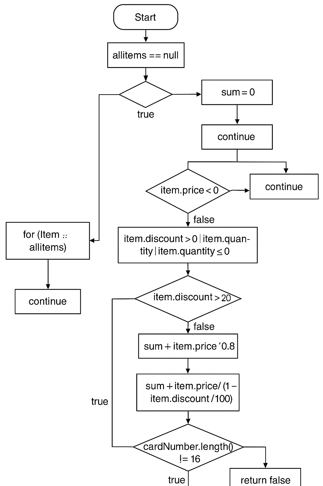

Stefan Tasevski 183122
2. CFG:
 
- NULL proverka (if(allItems == null))
- for loop
- proverka na ime (if (item.getName() == null || item.getName().length() == 0))
- discount/price/quantity check  (if (item.getPrice() > 300 || item.getDiscount() > 0 || item.getQuantity() > 10))
- presmetuvanje discount (if (item.getDiscount() > 0))
- proverka na kreditni kartichki
- sekoj statement kako varijabla ili povik za metod e "box(node)"
- sekoj if ili for e "diamond" ili node so 2 ili povekje razgranuvanja.
3. Identifikacija na site kritichni tochki, ciklomatskata kompleksnost go meri brojot(linearno) na nezavisnite patishta.
Ciklomatskata kompleksnost = D + 1
- D = brojot na kritichni tochki (if-ovi, for ciklusi, itn.)
- Kritichni tochki: 
	1. if (allItems == null)
	2. for (int i = 0; i < allItems.size(); i++)
	3. if (item.getName() == null || item.getName().length() == 0)
	- sekoj || OR operator se broi 2 pati.
	4. if (item.getPrice() > 300 || item.getDiscount() > 0 || item.getQuantity() > 10)
	- se broi kako 3 zaradi OR operatorot.
	5. if (item.getDiscount() > 0)
	6. if (cardNumber != null && cardNumber.length() == 16)
	- isto kako so OR operatorot taka i && AND operatorot ova se broi 2 pati.
	7. for (int j = 0; j < cardNumber.length(); j++)
	8. if(allowed.indexOf(c) == -1)
	9. else, po proverkata za kreditni kartichki, ne e nova tochka tuku samo novo razgranuvanje.

D = 12
Ciklomatskata kompleksnost = D + 1
==> Ciklomatskata kompleksnost  = 13

4.  1. Test za null vrednost (treba da frli exception)
    @Test(expected = RuntimeException.class)
    public void testNullAllItems() {
        SILab2.checkCart(null, "1234567890123456");
    }

-  2. Test za item so null ime (treba da frli exception)
    @Test(expected = RuntimeException.class)
    public void testItemWithNullName() {
        List<Item> items = Arrays.asList(new Item(null, 1, 100, 0));
        SILab2.checkCart(items, "1234567890123456");
    }

-  3. Test za item bez ime (treba da frli exception)
    @Test(expected = RuntimeException.class)
    public void testItemWithEmptyName() {
        List<Item> items = Arrays.asList(new Item("", 1, 100, 0));
        SILab2.checkCart(items, "1234567890123456");
    }

- 4.Test za dolzinata na brojot na kreditnata kartichka (greshna dolzhina)
    @Test(expected = RuntimeException.class)
    public void testInvalidCardNumberLength() {
        List<Item> items = Arrays.asList(new Item("Apple", 1, 100, 0));
        SILab2.checkCart(items, "123456789012345"); // only 15 digits
    }

- 5. Test za dali koristi ne numerichki karakteri namesto brojki za kreditnata kartichka (sodrzhi ne numerichki karakteri)
    @Test(expected = RuntimeException.class)
    public void testInvalidCardNumberCharacter() {
        List<Item> items = Arrays.asList(new Item("Apple", 1, 100, 0));
        SILab2.checkCart(items, "12345678901234AB"); // contains 'A' and 'B'
    }

- 6. Ako proizvodot ima cena nad 300 (ke odzeme 30)
    @Test
    public void testItemPriceGreaterThan300() {
        List<Item> items = Arrays.asList(new Item("Expensive", 1, 350, 0));
        // sum = -30 + 350 = 320
        assertEquals(320, SILab2.checkCart(items, "1234567890123456"), 0.01);
    }

- 7. Test za proizvod so popust (ke odzeme 30 i ke go zeme vo predvid popustot)
    @Test
    public void testItemWithDiscount() {
        List<Item> items = Arrays.asList(new Item("Discounted", 2, 100, 0.1));
        // sum = -30 + 2*100*0.9 = -30 + 180 = 150
        assertEquals(150, SILab2.checkCart(items, "1234567890123456"), 0.01);
    }
- 8. Test za proizvod so pogolem kvantitet od 10 (ke odzeme 30)
    @Test
    public void testItemWithLargeQuantity() {
        List<Item> items = Arrays.asList(new Item("Bulk", 11, 10, 0));
        // sum = -30 + 11*10 = -30 + 110 = 80
        assertEquals(80, SILab2.checkCart(items, "1234567890123456"), 0.01);
    }

- 9. Test za normalen proizvod (bez popust, cena pomala od 300, broj na proizvodi pomal ili ednakov na 10)
    @Test
    public void testNormalItem() {
        List<Item> items = Arrays.asList(new Item("Normal", 2, 100, 0));
        // sum = 2*100 = 200
        assertEquals(200, SILab2.checkCart(items, "1234567890123456"), 0.01);
    }

5. Za da bidat opfateni site kombinacii : 2^3 = 8. So pomosh na setiranje na proizvodi i potoa povikuvanje na istite mozhe da se testira.
- Item i1 = new Item("A", 1, 100, 0); site kriteriumi se greshni ne vleguva vo IF
- Item i2 = new Item("B", 11, 100, 0); false false i true vleguva vo IF
- Item i3 = new Item("C", 1, 100, 0.1); cena false, popust true, kolichina false. Vleguva vo IF
- Item i4 = new Item("D", 11, 100, 0.1); cena false, popust i kolichina true. Vleguva vo IF.
- Item i5 = new Item("E", 1, 350, 0); cena true, popust i kolichina false. Vleguva vo IF.
- Item i6 = new Item("F", 11, 350, 0); cena i kolichina true, popust false. Vleguva vo IF.
- Item i7 = new Item("G", 1, 350, 0.1); cena i popust true, kolichina false. Vleguva vo IF.
- Item i8 = new Item("H", 11, 350, 0.1); site se true. Vleguva vo IF
-SILab2.checkCart(Arrays.asList(i1), card);
        SILab2.checkCart(Arrays.asList(i2), card);
        SILab2.checkCart(Arrays.asList(i3), card);
        SILab2.checkCart(Arrays.asList(i4), card);
        SILab2.checkCart(Arrays.asList(i5), card);
        SILab2.checkCart(Arrays.asList(i6), card);
        SILab2.checkCart(Arrays.asList(i7), card);
        SILab2.checkCart(Arrays.asList(i8), card);.
- Funkcijata checkCart kje proveri dali se ispolnuva if-uslovot za dadeniot proizvod.

